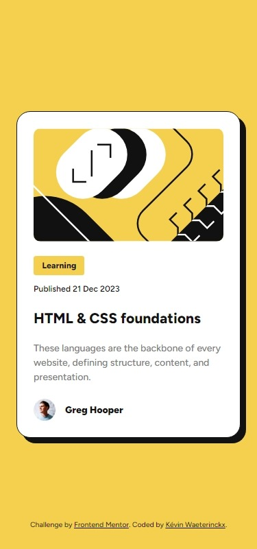
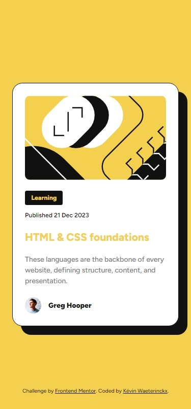

# Frontend Mentor - Blog preview card solution

This is a solution to the [Blog preview card challenge on Frontend Mentor](https://www.frontendmentor.io/challenges/blog-preview-card-ckPaj01IcS). Frontend Mentor challenges help you improve your coding skills by building realistic projects. 

## Table of contents

- [Overview](#overview)
  - [The challenge](#the-challenge)
  - [Screenshot](#screenshot)
  - [Links](#links)
- [My process](#my-process)
  - [Built with](#built-with)
  - [What I learned](#what-i-learned)
  - [Continued development](#continued-development)
- [Author](#author)

## Overview

### The challenge

Users should be able to:

- See hover and focus states for all interactive elements on the page

### Screenshot




### Links

- Solution URL: [Solution on GitHub](https://github.com/kwaeterinckx/FrontentMentorChallenge-BlogPreviewCard)
- Live Site URL: [Live version on Netlify](https://leafy-liger-eefe71.netlify.app/)

## My process

### Built with

- Semantic HTML5 markup
- CSS custom properties
- Flexbox
- CSS Grid
- Mobile-first workflow

### What I learned

I learned to use the :has pseudo class to add the hover effect only when the blog title is focussed, not the link in the tag.  
And I discovered, by trying, that you can nest a **:is** in a **:has** 🤩

```css
.blog__article:has(.blog__title__link:is(:hover, :focus-visible)) {
  box-shadow: 17px 17px 0 var(--clr-black);
}
```

I used more semantic html elements, like the `<time>` tag for the publication date.

```html
<p class="blog__pub-date">Published <time datetime="2023-12-21">21 Dec 2023</time></p>
```

### Continued development

Hover effects are part of the design. With the last pseudo class selectors, it becomes easier to implement cool
hover effects without JS.  
I always struggled to make it look nice, but with :has *(and also :focus-within)*, I can add that extra touch that makes it awesome.

## Author

Kévin Waeterinckx

- Frontend Mentor - [@kwaeterinckx](https://www.frontendmentor.io/profile/kwaeterinckx)
- GitHub - [kwaeterinckx](https://github.com/kwaeterinckx)
- LinkedIn - [Kévin Waeterinckx](https://www.linkedin.com/in/kévin-waeterinckx-58256518a)